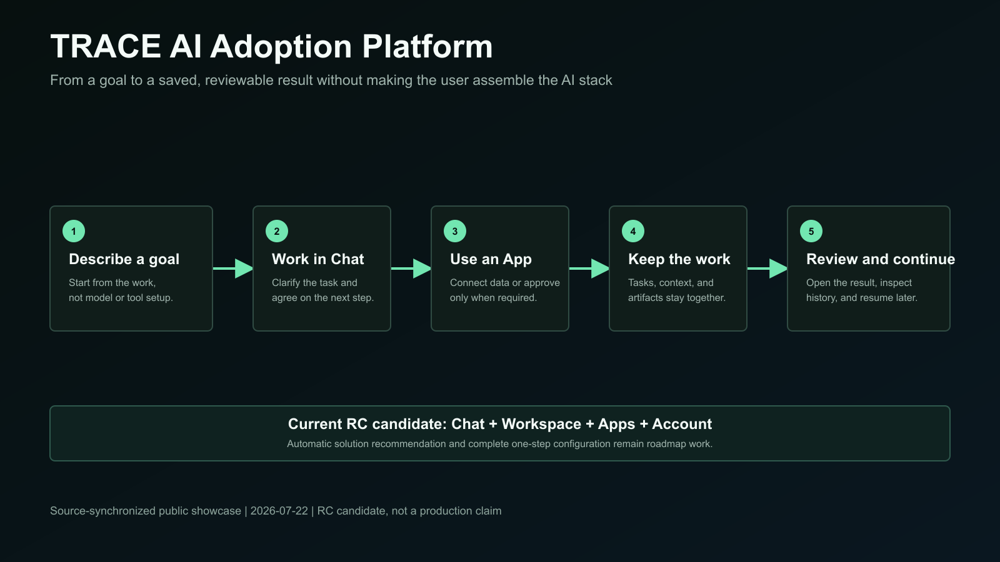
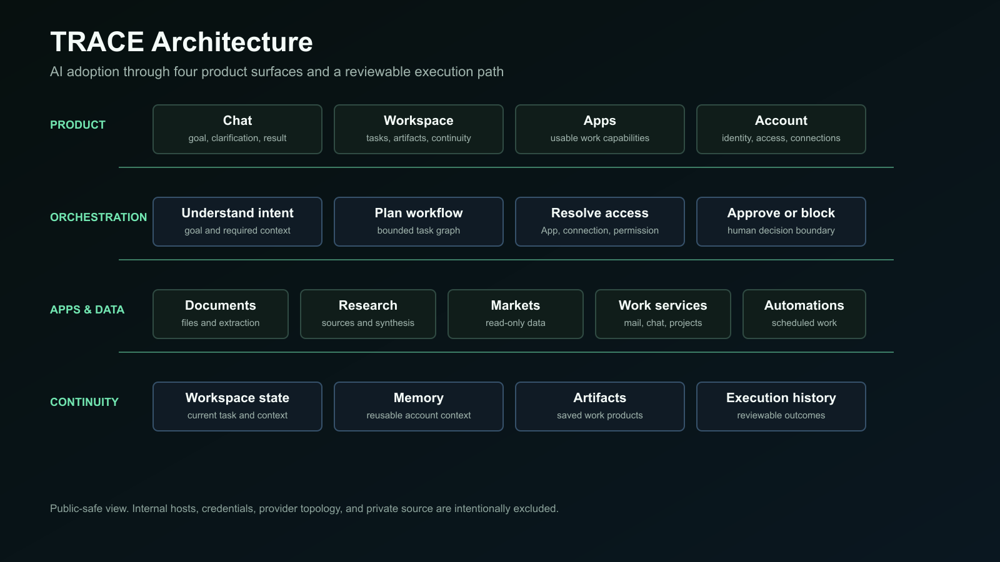
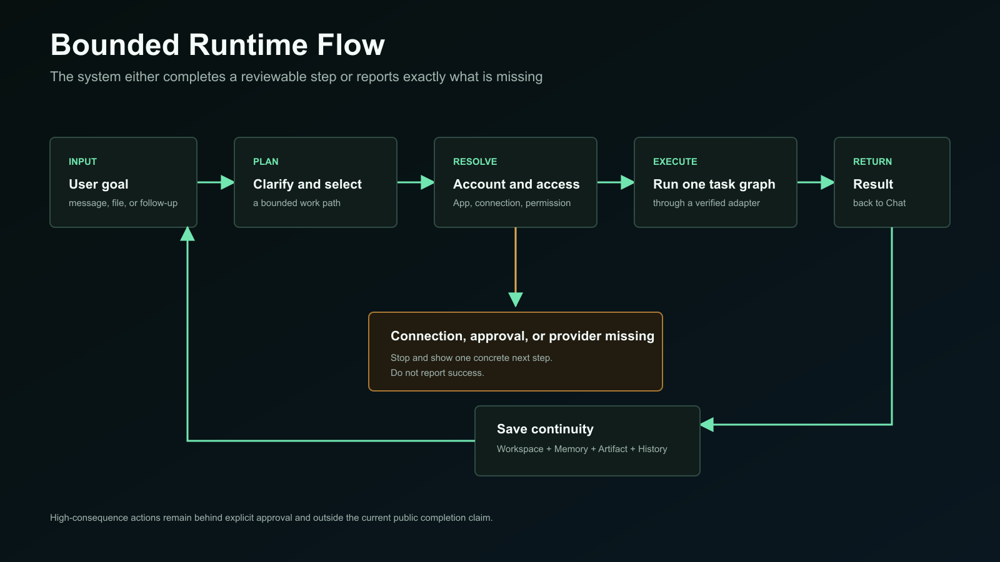

# TRACE

[](https://github.com/0xChrisSKR/trace-ai-platform-showcase/actions/workflows/ci.yml)




TRACE is an AI adoption platform in development. A user starts with a goal, works through conversation, and receives a result that stays connected to the same workspace, account, and execution history.

This repository is the official public showcase. It contains product explanations, public-safe architecture, diagrams, and implementation status. It does not contain the private product source, credentials, deployment topology, or production configuration.

**Last synchronized:** 2026-07-22 against the latest RC candidate source at `1a92fb01`.

## What TRACE Is

TRACE is not another standalone AI agent. It is designed to help people adopt AI without first learning models, agents, registries, or workflow infrastructure.

The current product loop is:

```text
Describe a goal
  -> work with TRACE in Chat
  -> use an available App or connection
  -> keep tasks and results in Workspace
  -> review the result and execution history
  -> continue later from the same context
```

The longer-term adoption flow adds automatic solution recommendation and configuration. Those steps remain roadmap work and are not presented here as complete.

## Current Product Surfaces

| Surface | What the user sees | Current source status |
| --- | --- | --- |
| Chat | A single place to describe work, clarify requirements, and receive results | Implemented in the RC candidate |
| Workspace | Current work, tasks, active agent, artifacts, memory, and execution history | Implemented in the RC candidate |
| Apps | Installed capabilities, connection requirements, setup state, and launch actions | Install, enable, bind, test, invoke, and remove lifecycle exists in the RC candidate |
| Account | Identity, plan, permissions, connections, sessions, and safety boundaries | Implemented; some external connection flows still require RC validation |

The source candidate also contains bounded workflows for document analysis, research, market analysis, account-owned background work, and read-only financial context. Availability depends on account state, connection health, permissions, and deployment validation.

## Why It Exists

Most AI tools stop at an answer. Real work also needs context, external services, task state, approval boundaries, saved results, and a way to resume later.

TRACE brings those pieces into one product flow:

- Start from the work, not the tool setup.
- Ask for one connection or approval only when the task requires it.
- Keep the user's account as the owner of work and history.
- Show blockers instead of reporting false success.
- Preserve useful results as artifacts that can be reviewed and continued.

## Product Architecture



The public architecture has four layers:

1. **Product:** Chat, Workspace, Apps, and Account.
2. **Orchestration:** intent understanding, workflow planning, capability selection, and approval gates.
3. **Execution:** authorized Apps, connected services, document and data adapters, and bounded agent work.
4. **Continuity:** workspace state, memory, artifacts, and execution history.

Technical detail: [Architecture](docs/ARCHITECTURE.md)

## Current Implementation Status

### Implemented in the latest RC candidate

- Goal-led Chat and onboarding paths.
- Account-owned Workspace continuity across messages, tasks, results, memory, and artifacts.
- App Center with lifecycle and honest readiness states.
- Bounded agent execution with visible blockers and approval boundaries.
- Document ingestion for text, Markdown, CSV, TSV, images with OCR, and PDF.
- Market-analysis and proof-recap task graphs.
- Candidate integrations for scheduled research, Gmail work, Telegram channels, GitHub monitoring, portfolio monitoring, Taiwan market work, and a daily work brief.

### Still requiring validation or promotion

- A clean RC build and promotion of the latest candidate.
- Authenticated browser validation across first-use, refresh, reconnect, and account isolation.
- End-to-end validation of every external App and background workflow.
- Automatic solution recommendation and one-step workspace/App configuration.
- Replacement of the current public site by the RC candidate.

Detailed status: [Current implementation](docs/CURRENT_MAINLINE_STATUS.md)

## Runtime Flow



A task is allowed to proceed only when the required account, connection, capability, and approval state can be resolved. Otherwise TRACE returns a clear setup step or blocker. High-consequence actions remain outside the current public claim.

## Technology

The current implementation uses TypeScript, Next.js, React, assistant-ui, LangGraph, CCXT, WalletConnect/Reown, AgentKit, Supabase, Prisma, and adapter-based integrations. Each technology serves a bounded role; the user-facing product does not require users to understand the underlying runtime vocabulary.

## My Role

I define the product direction, user workflows, system boundaries, and public narrative. I use AI coding systems during implementation, then read, review, modify, test, and validate the result. I am responsible for deciding what is complete, what remains experimental, and what can be stated publicly.

## What Can Be Reviewed Here

- [Product](docs/PRODUCT.md)
- [Why TRACE](docs/WHY_TRACE.md)
- [AI adoption model](docs/AI_ADOPTION.md)
- [Architecture](docs/ARCHITECTURE.md)
- [Vision](docs/VISION.md)
- [Roadmap](docs/ROADMAP.md)
- [Synchronization report](docs/TRACE_SYNCHRONIZATION_REPORT.md)
- [Implementation/showcase gaps](docs/GAP_REPORT.md)
- [Screenshot status and capture checklist](docs/SCREENSHOTS.md)
- [Engineering decisions](docs/ENGINEERING_DECISIONS.md)
- [Claim boundary](docs/WHAT_THIS_DOES_NOT_CLAIM.md)

## Public Demo

The full TRACE RC candidate is not presented here as a public production deployment. [TRACE ProofFeed](https://trace-prooffeed.vercel.app) is a separate public demo of the verification direction that informed TRACE's reviewable-result model.

## Related Projects

- [TRACE ProofFeed](https://github.com/TRACE-CChain-Labs/trace-prooffeed-solana-agent)
- [Immune RPC Gate](https://github.com/0xChrisSKR/immune-rpc-gate)
- [GO2 Agent Lab](https://github.com/0xChrisSKR/go2-agent-lab)

## Claim Boundary

This showcase does not claim production users, revenue, production-scale uptime, completed autonomous trading, autonomous wallet mutation, payment activation, deployed GO2 control, or full public-site replacement. The latest code is an RC candidate and remains subject to build, deployment, and authenticated product validation.
