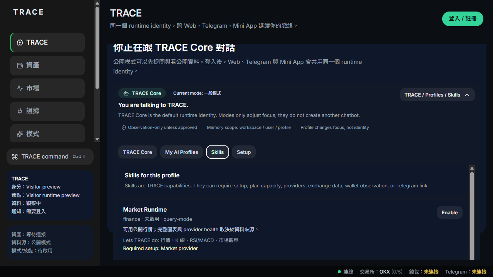

# TRACE AI Platform Showcase

I designed TRACE AI Platform as a public-safe showcase of AI workflow orchestration: model routing, shared execution state, skill concepts, assistant/workspace UI, review trails, wallet-aware boundaries, and technical validation.

This repository is not a source-code mirror. It is an engineering showcase for recruiters and engineering managers.

## Problem

AI features often remain isolated chat boxes. Once AI touches real workflows, the hard problems become state, routing, reviewability, permissions, action boundaries, and user trust.

## What I Designed

- AI workflow orchestration instead of one-off prompt execution.
- Shared execution state so actions remain reviewable.
- Skill and agent concepts for separating capabilities from UI.
- Assistant/workspace UI for human review and iteration.
- Wallet-aware action boundaries for higher-risk workflows.
- Public-safe evidence packaging through screenshots and architecture notes.

## Architecture

See [docs/ARCHITECTURE.md](docs/ARCHITECTURE.md).

## Screenshots

1. `assets/screenshots/01-trace-ai-skills-tab.png`
2. `assets/screenshots/02-trace-ai-profile-list.png`
3. `assets/screenshots/03-trace-workspace-terminal.png`

## What This Proves

See [docs/WHAT_THIS_PROVES.md](docs/WHAT_THIS_PROVES.md).

## What This Does Not Claim

See [docs/WHAT_THIS_DOES_NOT_CLAIM.md](docs/WHAT_THIS_DOES_NOT_CLAIM.md).

## Public Status

TRACE AI Platform is presented as architecture, product evolution, screenshots, and public-safe system design evidence. The public demoable slice is TRACE ProofFeed.
