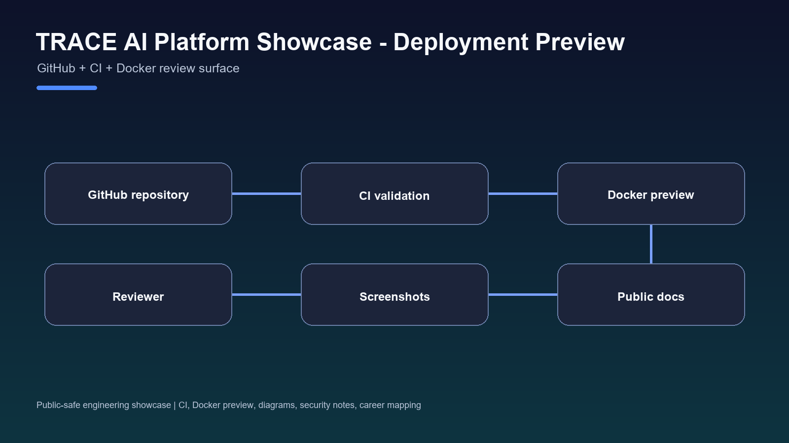

# TRACE AI Platform Showcase

[](https://github.com/0xChrisSKR/trace-ai-platform-showcase/actions/workflows/ci.yml)

[](https://github.com/0xChrisSKR)


TRACE AI Platform is where I collect my thinking about chat-first AI agent systems, runtime state, review trails, skills, workspace design, and infrastructure.

The current TRACE mainline direction is a Chat-first Agent OS. Conversation is the interface; planning, LangGraph runtime flow, capability routing, OSS kernels, skills, memory, proof, and receipts sit underneath it.

This public showcase explains the direction without exposing private infrastructure, runtime code, deployment details, secrets, or RC1 internals. RC1 remains an integration lab, while the public c-chain.org site remains public/stable and should not be described as fully replaced.

## One-line Positioning

Chat-first AI Agent OS showcase for conversation-led workflows, LangGraph-style orchestration, OSS kernel composition, shared execution state, review trails, and system integration.

## Problem

AI products should not become disconnected dashboards or isolated architecture pages. Once AI is used in real work, the important questions become how conversation turns into plans, how workflows execute, which capability is selected, how state is preserved, and how risky actions stay reviewable.

## My Role

I handled product direction, workflow design, platform architecture, interface planning, AI-assisted implementation direction, technical review, and GitHub packaging.

## What It Includes

- AI workflow design
- Chat-first interface direction
- Planner and LangGraph runtime direction
- Capability Router / Kernel Composer direction
- Skills and workspace concepts
- Shared execution state
- Memory and review trail concepts
- Policy and receipt concepts
- Infrastructure and verification direction
- Screenshots and architecture documentation

## Tech Stack

- AI agent workflow design
- Chat-first Agent OS architecture
- LangGraph runtime / planning direction
- OSS kernel composition
- TypeScript / Next.js product surface
- Runtime architecture
- Workspace UI planning
- Review trail and verification concepts
- Infrastructure design


## Engineering Assets




- CI workflow: [.github/workflows/ci.yml](.github/workflows/ci.yml)
- Deployment preview: [Dockerfile](Dockerfile), [docker-compose.yml](docker-compose.yml), [.env.example](.env.example)
- API examples: [docs/API_EXAMPLES.md](docs/API_EXAMPLES.md)
- Folder structure: [docs/FOLDER_STRUCTURE.md](docs/FOLDER_STRUCTURE.md)
- Engineering notes: [docs/ENGINEERING_NOTES.md](docs/ENGINEERING_NOTES.md)
- Performance notes: [docs/PERFORMANCE.md](docs/PERFORMANCE.md)
- Security notes: [docs/SECURITY.md](docs/SECURITY.md)
- Future work: [docs/FUTURE_WORK.md](docs/FUTURE_WORK.md)
- Current mainline status: [docs/CURRENT_MAINLINE_STATUS.md](docs/CURRENT_MAINLINE_STATUS.md)
- Reviewer notes: [docs/CAREER_MAPPING.md](docs/CAREER_MAPPING.md)

## Local Deployment Preview

```bash
cp .env.example .env
docker compose up --build
```

Open `http://localhost:8080` after the container starts. This preview serves the public showcase package only.

The deployment preview is for repository review and portfolio evaluation. It does not expose private infrastructure, secrets, production topology, or private source code.

## Public Artifacts

- Architecture: [docs/ARCHITECTURE.md](docs/ARCHITECTURE.md)
- Public artifacts: [docs/PUBLIC_ARTIFACTS.md](docs/PUBLIC_ARTIFACTS.md)
- Visual artifacts: [docs/SCREENSHOTS.md](docs/SCREENSHOTS.md)
- Lessons learned: [docs/LESSONS_LEARNED.md](docs/LESSONS_LEARNED.md)
- 104 summary: [docs/104_PROJECT_SUMMARY.md](docs/104_PROJECT_SUMMARY.md)
- What this proves: [docs/WHAT_THIS_PROVES.md](docs/WHAT_THIS_PROVES.md)
- What this does not claim: [docs/WHAT_THIS_DOES_NOT_CLAIM.md](docs/WHAT_THIS_DOES_NOT_CLAIM.md)

## Screenshots

1. `assets/screenshots/01-trace-ai-skills-tab.png`
2. `assets/screenshots/02-trace-ai-profile-list.png`
3. `assets/screenshots/03-trace-workspace-terminal.png`

## Relation to the Portfolio Narrative

TRACE AI Platform is the latest point in my product evolution: WorldPeace DAO -> C-Chain Infrastructure -> Immune RPC Gate -> TRACE ProofFeed -> TRACE AI Platform.

It shows how earlier Web3, verification, and infrastructure work evolved into a chat-first Agent OS direction that composes existing OSS kernels instead of rebuilding every capability from scratch.

## Related Projects

- TRACE ProofFeed: https://github.com/TRACE-CChain-Labs/trace-prooffeed-solana-agent
- Immune RPC Gate: https://github.com/0xChrisSKR/immune-rpc-gate
- GO2 Agent Lab: https://github.com/0xChrisSKR/go2-agent-lab

## What A Reviewer Can Verify

- The product surface through screenshots.
- The architecture through diagrams and docs.
- The current mainline story through `docs/CURRENT_MAINLINE_STATUS.md`.
- The project scope through the claim boundary documents.
- The portfolio relationship through the linked public repositories.

## What This Does Not Claim

This is a public showcase, not a production-user claim. I am not claiming revenue, uptime, customer adoption, finished trading execution, autonomous wallet mutation, production robotics deployment, or that every line was manually typed by me.
