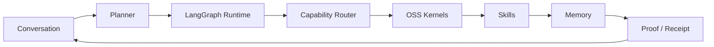

# Architecture

TRACE AI Platform is presented as a Chat-first AI Agent OS direction.

## Key Decisions

- Treat conversation as the operating surface, not a decorative chat panel beside a dashboard.
- Use LangGraph-style runtime orchestration for planning and workflow continuity.
- Compose existing OSS kernels where they are stronger than custom implementations.
- Preserve shared execution state so actions can be reviewed.
- Keep skill/capability boundaries separate from UI surfaces.
- Keep higher-risk wallet or transaction actions explicitly human-reviewed.
- Present the public version through architecture and screenshots, not implementation details.

## Public-Safe Kernel Direction

- `assistant-ui`: conversation UI direction.
- LangGraph: runtime / planning / workflow orchestration.
- CCXT: exchange / market data abstraction.
- WalletConnect / Reown: wallet session boundary.
- AgentKit: approval-gated execution provider.
- Durable memory / proof: public-safe concept only; no private VPS details are exposed.
