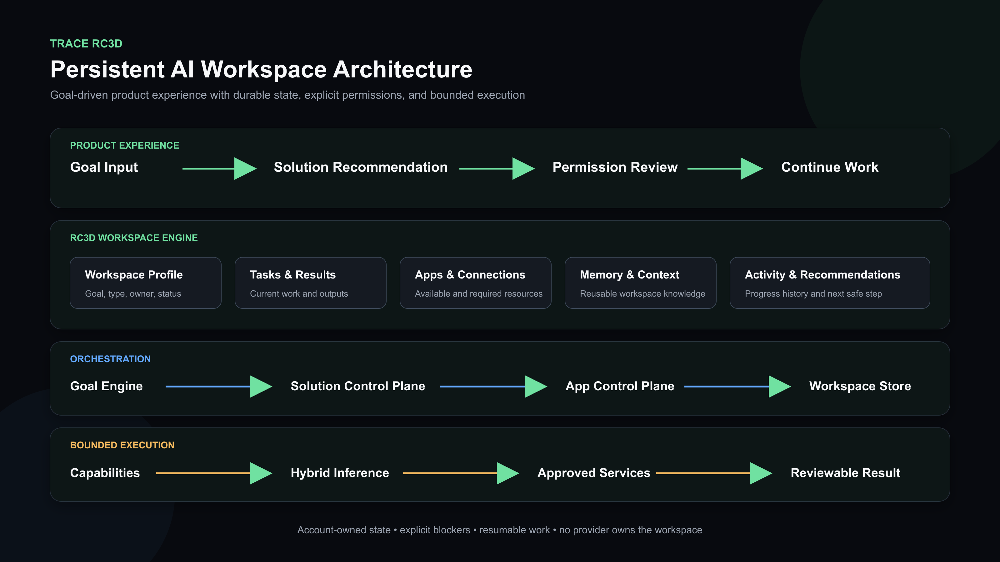
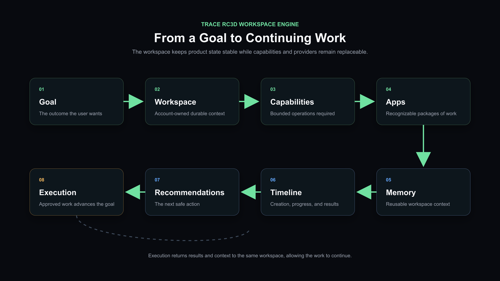

# Product Architecture

TRACE separates the user experience from the implementation needed to execute and preserve work. The user starts with a goal; the system resolves the workspace, Apps, capabilities, connections, and permissions behind that goal.



## Workspace Flow



```text
Goal
  -> Workspace
  -> Capabilities
  -> Apps
  -> Memory
  -> Timeline
  -> Recommendations
  -> Execution
```

This flow describes the durable product cycle:

1. **Goal** defines the outcome and gives the system a reason to act.
2. **Workspace** becomes the account-owned context for the goal.
3. **Capabilities** identify the bounded operations required.
4. **Apps** package those capabilities into work the user recognizes.
5. **Memory** preserves useful context inside the workspace boundary.
6. **Timeline** records creation, extension, progress, and results.
7. **Recommendations** keep the next safe action visible.
8. **Execution** advances the work only after required setup and permission checks pass.

## Product Layer

The product layer contains the goal-first home, solution recommendation, workspace views, App surfaces, and account controls. Internal terms such as registry, task graph, adapter, and provider routing are not required for normal use.

## Workspace Engine

RC3D stores a workspace as one account-owned model containing:

- workspace type, goal, title, and summary;
- installed solution and App identifiers;
- capability and resource references;
- permissions and connection state;
- tasks, results, and operating context;
- memory records;
- activity and recommendations.

The engine supports three continuity decisions:

- create a new workspace;
- continue an existing workspace;
- extend an existing workspace with another compatible solution.

The validated RC3D regression confirms that reopening and extension do not create a second competing store.

## Orchestration Layer

The public-safe orchestration path is:

```text
Goal Engine
  -> Solution recommendation
  -> Permission and connection review
  -> App lifecycle
  -> Workspace create / continue / extend
  -> Bounded execution
  -> Result, memory, activity, and next recommendation
```

The Goal Engine selects from verified Solution manifests. The Solution control plane coordinates App preparation and workspace persistence. The capability runtime remains behind a stable boundary so a product workflow is not tied to one model or provider.

## Hybrid AI Boundary

TRACE treats inference as a replaceable account-owned resource. A configured native, local, bring-your-own, or enterprise inference path can serve the same product contract without becoming the owner of workspace state.

RC3D validates the workspace and product boundary. It does not claim that every possible inference provider combination has completed production validation.

## Safety Invariants

- The TRACE Account owns the workspace and its history.
- External services and devices are replaceable connections, not workspace owners.
- A missing connection, capability, permission, or healthy adapter produces an explicit blocker.
- Workspace creation or extension requires user confirmation when permissions are requested.
- High-consequence actions are outside the current public claim unless separately validated.
- No private topology, credentials, account data, or implementation source is included here.
