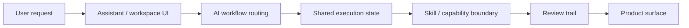

# Architecture

TRACE AI Platform is presented as an AI workflow orchestration system.

## Key Decisions

- Treat AI as a workflow system, not only a chat interface.
- Preserve shared execution state so actions can be reviewed.
- Keep skill/capability boundaries separate from UI surfaces.
- Keep higher-risk wallet or transaction actions explicitly human-reviewed.
- Present the public version through architecture and screenshots, not implementation details.
