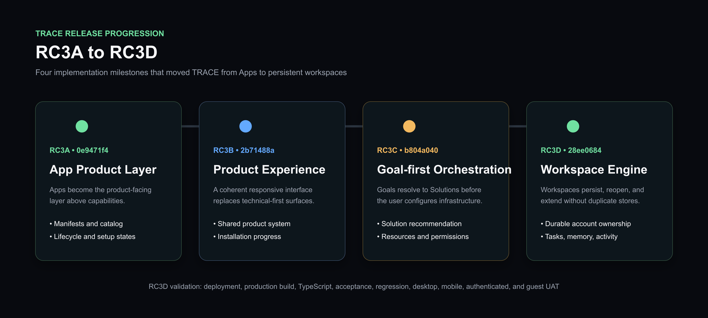

# RC3 Release Showcase

## RC3A - App Product Layer

**Commit:** `0e9471f4`

RC3A introduced Apps as the product-facing layer above capabilities. It added App manifests, catalog and detail surfaces, lifecycle controls, GitHub package review, and the first product home.

## RC3B - Product Experience

**Commit:** `2b71488a`

RC3B refined the product hierarchy, responsive layout, App installation progress, shared visual system, and navigation so the implementation could be evaluated as a coherent product rather than a collection of technical surfaces.

## RC3C - Goal-first Orchestration

**Commit:** `b804a040`

RC3C added the Goal Engine, Solution manifests, recommendation flow, starter tasks, required resources, permissions, and Solution installation control plane. Users could begin from an outcome instead of selecting infrastructure.

## RC3D - Persistent Workspace Engine

**Commit:** `28ee0684`

RC3D connected the recommendation flow to persistent account-owned workspaces. It added workspace types, tasks, results, memory, activity, recommendations, connection projection, and create/continue/extend behavior.

## Release Validation

RC3D completed engineering validation for deployment, production build, TypeScript, acceptance, regression, desktop UAT, mobile UAT, authenticated UAT, and guest UAT.

The wider repository retains 354 legacy ESLint findings. RC3D introduced zero new lint errors.
