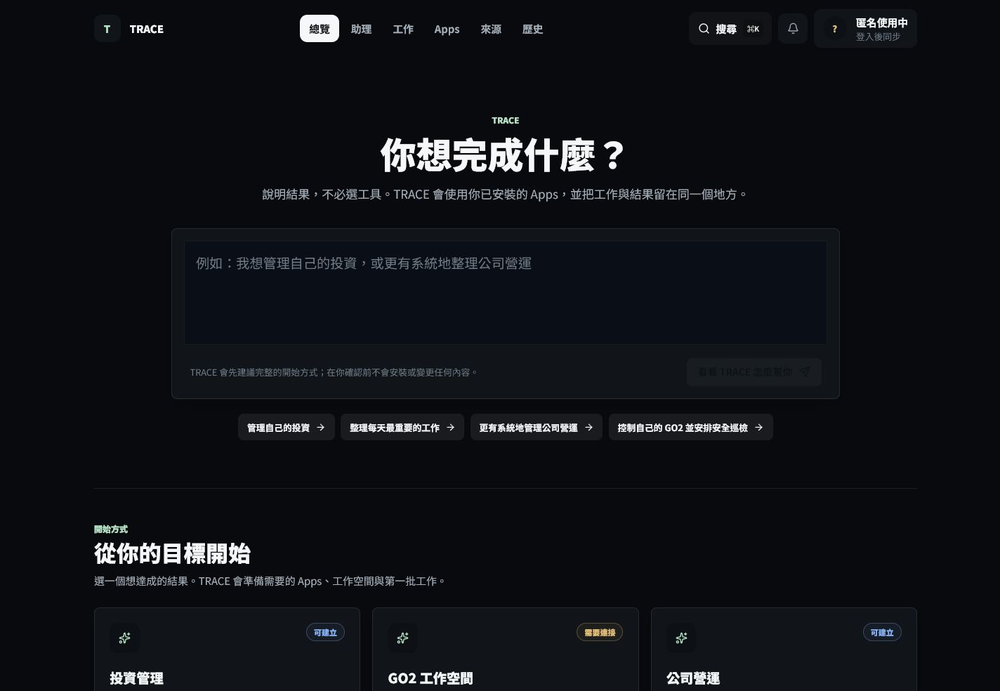
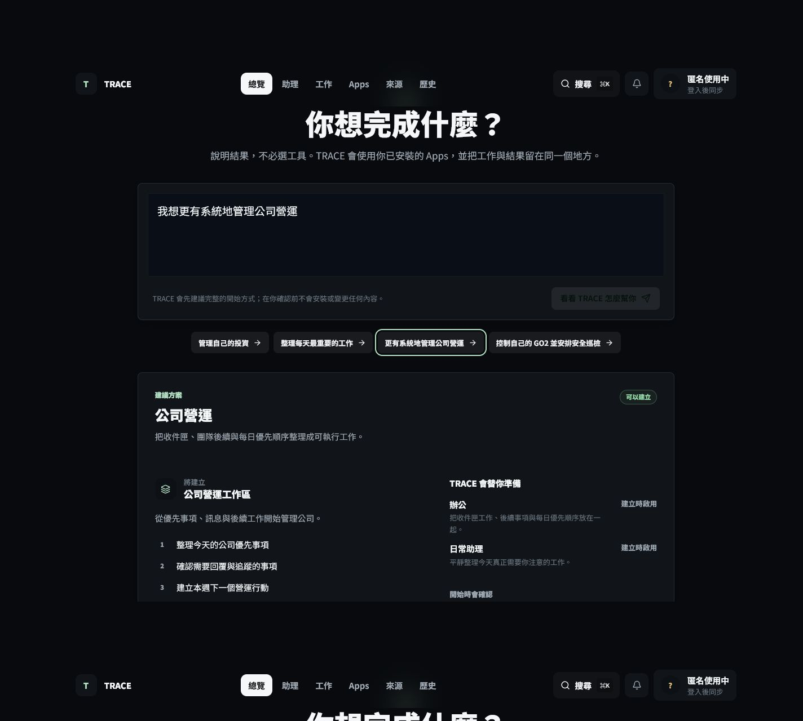

# Screenshots

These screenshots were captured from a production build of validated RC3D commit `28ee0684`. No private account data, credentials, or infrastructure details are shown.

## 1. Goal-first Home

The user begins with an outcome. TRACE presents verified Solution starting points without asking the user to choose a model, planner, registry, or runtime.

## 2. Solution Recommendation

Before workspace creation, the user can review the proposed workspace, starter tasks, Apps, resources, and permissions.

## 3. Mobile Product View

[Open the RC3D mobile capture](../assets/screenshots/rc3d-goal-home-mobile.png)

The mobile capture is retained as responsive UAT evidence. The two desktop images are the recommended recruiter-facing screenshots.

## Recommended Order

1. `rc3d-goal-home-desktop.png`
2. `rc3d-solution-recommendation-desktop.png`
3. `rc3d-goal-home-mobile.png`
